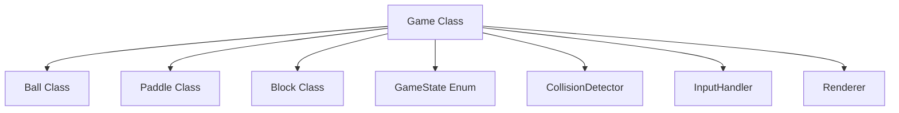

# 設計文書

## 概要

ブロック崩しゲームをHTML5 CanvasとJavaScriptを使用してWebブラウザ上で実装します。ゲームは単一のHTMLページとして動作し、Canvas APIを使用して2Dグラフィックスを描画します。ゲームループパターンを採用し、requestAnimationFrameを使用してスムーズなアニメーションを実現します。

## アーキテクチャ

### 技術スタック
- HTML5 Canvas API（2Dグラフィックス描画）
- JavaScript ES6+（ゲームロジック）
- CSS（基本的なスタイリング）

### アーキテクチャパターン
- ゲームループパターン：更新と描画を分離した継続的な処理
- オブジェクト指向設計：ゲーム要素を個別のクラスとして実装
- 状態管理パターン：ゲーム状態を明確に管理



## コンポーネントとインターフェース

### Game クラス
ゲーム全体を管理するメインクラス

**プロパティ:**
- canvas: HTMLCanvasElement
- ctx: CanvasRenderingContext2D
- gameState: GameState
- score: number
- ball: Ball
- paddle: Paddle
- blocks: Block[]

**メソッド:**
- init(): ゲームの初期化
- gameLoop(): メインゲームループ
- update(): ゲーム状態の更新
- render(): 画面描画
- reset(): ゲームリセット
- handleGameOver(): ゲームオーバー処理
- handleGameWin(): ゲームクリア処理

### Ball クラス
ボールの動作を管理

**プロパティ:**
- x, y: number（位置）
- dx, dy: number（速度）
- radius: number（半径）
- speed: number（基本速度）

**メソッド:**
- update(): 位置更新
- render(ctx): 描画
- reverseX(): X方向の速度反転
- reverseY(): Y方向の速度反転
- reset(): 初期位置にリセット

### Paddle クラス
パドルの動作を管理

**プロパティ:**
- x, y: number（位置）
- width, height: number（サイズ）
- speed: number（移動速度）

**メソッド:**
- update(): 位置更新
- render(ctx): 描画
- moveLeft(): 左移動
- moveRight(): 右移動
- getBounds(): 境界矩形取得

### Block クラス
ブロックを管理

**プロパティ:**
- x, y: number（位置）
- width, height: number（サイズ）
- color: string（色）
- destroyed: boolean（破壊状態）

**メソッド:**
- render(ctx): 描画
- destroy(): 破壊処理
- getBounds(): 境界矩形取得

### InputHandler クラス
キーボード入力を管理

**プロパティ:**
- keys: Set<string>（押下中のキー）

**メソッド:**
- init(): イベントリスナー設定
- isKeyPressed(key): キー押下状態確認
- handleKeyDown(event): キー押下処理
- handleKeyUp(event): キー離上処理

### CollisionDetector クラス
衝突検出を管理

**メソッド:**
- checkBallPaddleCollision(ball, paddle): ボールとパドルの衝突
- checkBallBlockCollision(ball, block): ボールとブロックの衝突
- checkBallWallCollision(ball, canvasWidth, canvasHeight): ボールと壁の衝突
- rectIntersect(rect1, rect2): 矩形同士の衝突判定

## データモデル

### GameState 列挙型
```javascript
const GameState = {
    PLAYING: 'playing',
    GAME_OVER: 'game_over',
    GAME_WIN: 'game_win',
    PAUSED: 'paused'
};
```

### 座標系
- 原点(0,0)は画面左上
- X軸は右方向が正
- Y軸は下方向が正
- キャンバスサイズ: 800x600ピクセル

### ゲーム定数
```javascript
const GAME_CONFIG = {
    CANVAS_WIDTH: 800,
    CANVAS_HEIGHT: 600,
    PADDLE_WIDTH: 100,
    PADDLE_HEIGHT: 20,
    BALL_RADIUS: 10,
    BALL_SPEED: 5,
    PADDLE_SPEED: 8,
    BLOCK_WIDTH: 75,
    BLOCK_HEIGHT: 20,
    BLOCK_ROWS: 5,
    BLOCK_COLS: 10,
    BLOCK_PADDING: 5,
    POINTS_PER_BLOCK: 10
};
```

## エラーハンドリング

### Canvas初期化エラー
- Canvas要素が見つからない場合のエラーハンドリング
- 2Dコンテキストが取得できない場合の代替処理

### ゲーム状態エラー
- 無効な状態遷移の防止
- 予期しない状態での処理停止

### 入力エラー
- 無効なキー入力の無視
- イベントリスナーの適切な削除

## テスト戦略

### 単体テスト
- 各クラスの個別メソッドのテスト
- 衝突検出アルゴリズムの精度テスト
- ゲーム状態遷移のテスト

### 統合テスト
- ゲームループ全体の動作テスト
- キーボード入力からゲーム反応までの統合テスト
- 複数のゲーム要素間の相互作用テスト

### 手動テスト
- 実際のゲームプレイによる動作確認
- 異なるブラウザでの互換性テスト
- パフォーマンステスト（フレームレート確認）

### テストケース例
1. ボールがパドルに当たって跳ね返る
2. ボールがブロックに当たってブロックが消える
3. 全ブロック破壊でゲームクリア
4. ボールが画面下端でゲームオーバー
5. パドルが画面端で停止する
6. スコアが正しく加算される